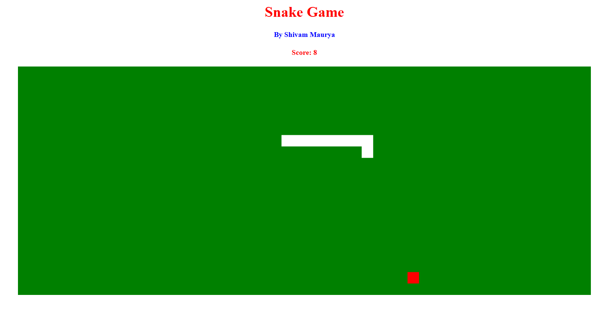

# Netflix Clone in React

This is a Javascript project. In this game, the player can move and eat the food and try to not bump in the walls and don't eat itself.

## Table of contents

-   [Overview](#overview)
    -   [The Theme](#the-theme)
    -   [Screenshot](#screenshot)
    -   [Links](#links)
-   [My process](#my-process)
    -   [Built with](#built-with)
-   [Author](#author)

## Overview

### The Theme

Users should be able to:

-   Move the snake left right up and down by using arrow keys or with WASD keys.
-   Eat the food and according to it the snake body size will grow and the player will score points which is displayed above.

### Screenshot

| Main Game                         |
| --------------------------------- |
|  |

### Links

-   [Github Solution](https://github.com/ShivamManiMaurya/Snake_Game)
-   [Live Site](https://shivammanimaurya.github.io/Snake_Game/)

## My process

### Built with

-   HTML5
-   CSS custom properties
-   Flexbox
-   JavaScript

## Author

-   Website - [Shivam Maurya](https://shivammanimaurya.github.io/my_portfolio_website/)
-   GitHub Page - [Shivam Maurya GitHub](https://github.com/ShivamManiMaurya)
-   Linkedin - [@shivammanimaurya](https://www.linkedin.com/in/shivammanimaurya)
